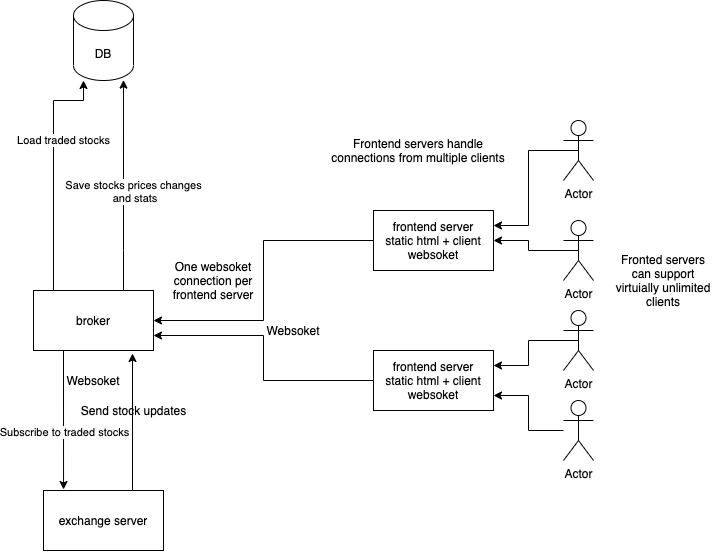

# Simple brokerage app implementation

All connections are done using websokets.
Itermidiate data stored in app memory (save and dump on regular inteval)

To scale brokerage app to 10 instruments - frontend app needs to implement stock based subcribtion, current implementetion sends all stocks to connected client.

To scale brokerage app to 1k instruments - move data storage into separate key-value db (ex: redis)

To scale brokerage app to 1M instruments - use multiple key-value db instances, utilise sharding, save transaction records in separate process detached from broker server

To scale app up to 1M - implemten proper stock based subscribtions (reduce broker app traffic) and add proxy apps

